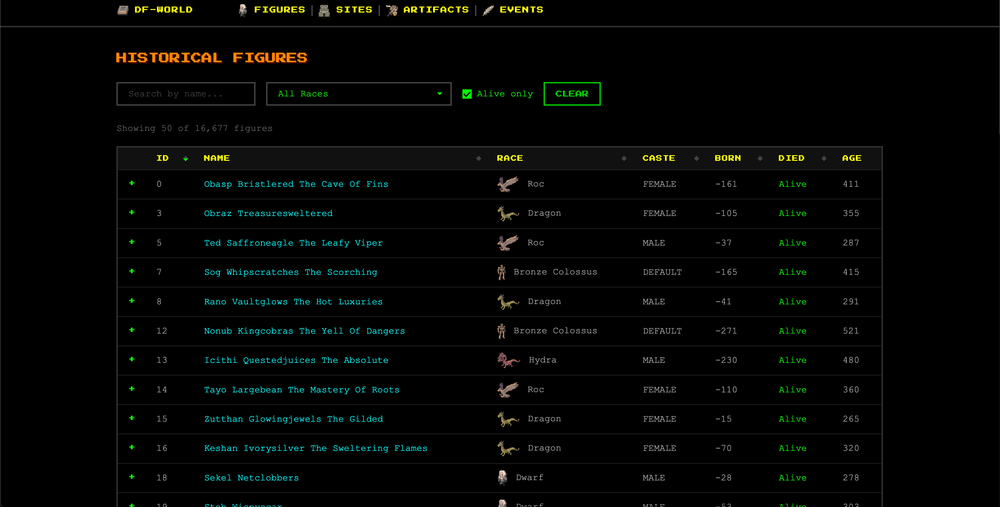
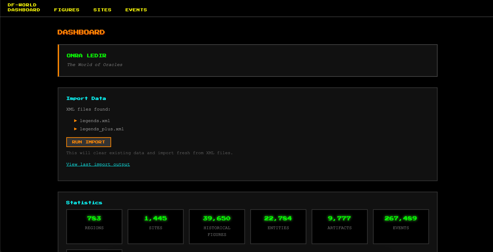
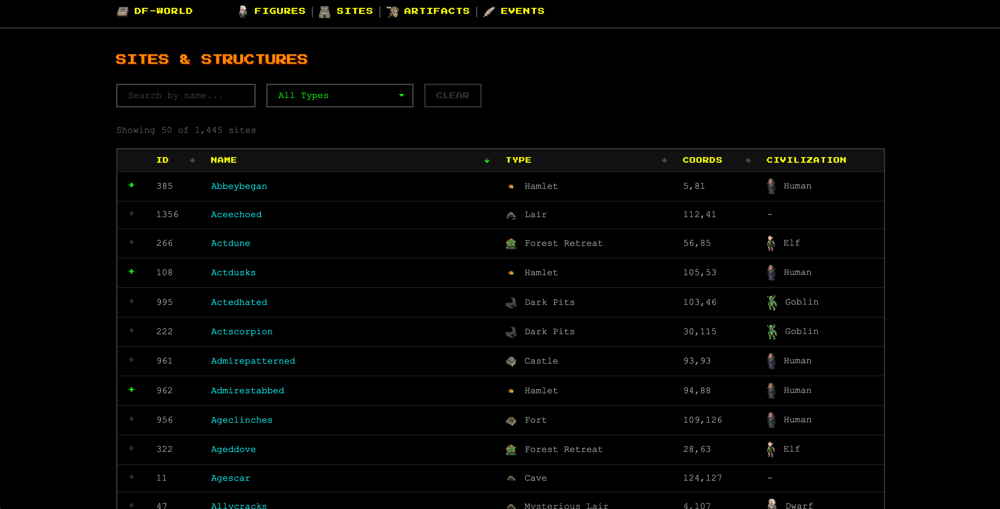
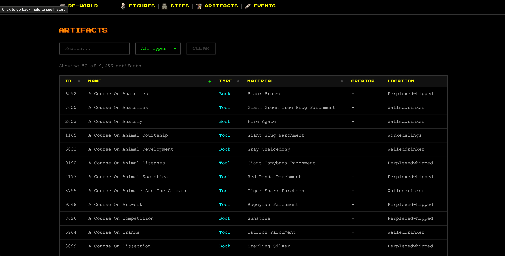

A web interface for exploring your Dwarf Fortress world history.

## Features

- **Historical Figures** — Browse all characters from your world, filter by race, search by name
- **Sites** — Explore fortresses, towns, caves, and other locations
- **Events** — View the history of your world year by year
- **Dashboard** — See world statistics at a glance

## Getting Started

### 1. Export Your World Data

**Option A: With DFHack (recommended)**
In Dwarf Fortress with [DFHack](https://dfhack.org/):
1. Enter Legends mode (see below)
2. Press the export button (DFHack adds this automatically)

This creates `*-legends.xml` and `*-legends_plus.xml` with full data.

**Option B: Vanilla DF**
In Legends mode, export your world data to get `*-legends.xml`.

Note: Without DFHack, some features are limited (no structures, entities, relationships, or written content).

#### How to Access Legends Mode

**Classic DF:** Main Menu → Legends

**Steam DF:**
1. Save and exit your current game
2. Main Menu → **Start Playing** → Select your world
3. Choose **Legends** mode instead of Continue/Fortress/Adventure

**If Legends doesn't appear:** Your world needs generated history. Create a new world or let your current game run for a while.

### 2. Install & Run

```bash
git clone git@github.com:INPVLSA/df-world.git
cd df-world
python3 -m venv venv
source venv/bin/activate  # Windows: venv\Scripts\activate
pip install -r requirements.txt
```

### 3. Import Your World

Copy both XML files to the `df-world` folder, then:

```bash
python build.py
```

### 4. Start Exploring

```bash
python app.py
```

Open http://localhost:5001 in your browser.

## Support

[](https://ko-fi.com/inpvlsa)

## License

[MIT](LICENSE)





