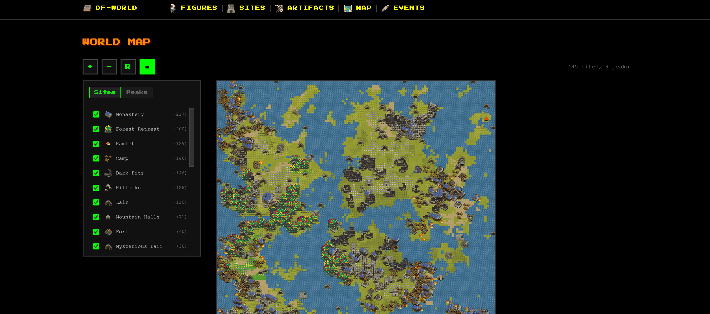
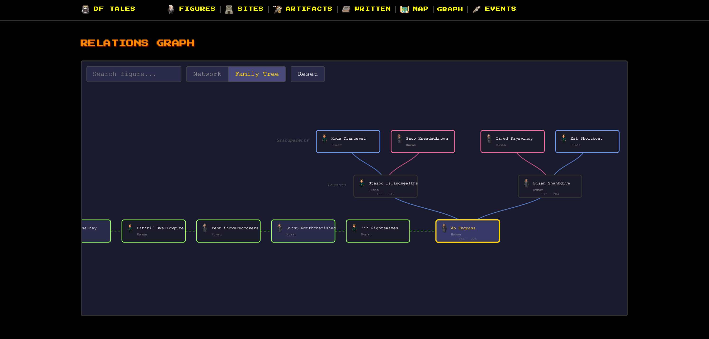

<p align="center">
  
  &nbsp;&nbsp;&nbsp;&nbsp;
  
</p>

<p align="center">A web interface for exploring your Dwarf Fortress world history.</p>


## Features

- **Historical Figures** — Browse all characters, filter by race, search by name, view affiliations and site links
- **Sites** — Explore fortresses, towns, caves, and other locations with their structures
- **Artifacts** — Discover named items with their creators, materials, and current holders
- **Events** — View the history of your world year by year
- **Interactive Map** — Terrain map with biomes, evilness variants, and mountain heights based on peak data. Pan, zoom (toward cursor), and click sites/peaks to navigate
- **Family Tree** — Visualize genealogical relationships with parents, grandparents, spouses, siblings, children, and grandchildren
- **Interactive References** — Click on any figure, site, artifact, or entity name to open a detailed popup with nested navigation
- **Dashboard** — See world statistics at a glance, manage multiple worlds

## Getting Started

### 1. Export Your World Data

#### With DFHack (Recommended)

[DFHack](https://dfhack.org/) provides extended data including structures, entities, relationships, and artifact details.

**From a new world or after world generation:**
1. Main Menu → **Legends** → Select your world
2. Click **Export XML** (DFHack adds a toggle for extended data - enable it)
3. Both `*-legends.xml` and `*-legends_plus.xml` are created

**From an active fortress/adventure game:**

⚠️ **Warning:** This is a ONE WAY TRIP - save your game first!

1. **Save your game** (you cannot safely return to fort/adventure mode)
2. Open DFHack console (press `` ` ``)
3. Run: `open-legends`
4. Confirm the save reminder dialog
5. Click **Export XML** with DFHack toggle enabled

See [DFHack exportlegends documentation](https://docs.dfhack.org/en/stable/docs/tools/exportlegends.html) for more options.

#### Without DFHack (Vanilla)

1. Main Menu → **Legends** → Select your world
2. Click **Export XML**

Note: Without DFHack, some features are limited (no structures, entities, relationships, artifact details, or written content).

### 2. Install & Run

```bash
git clone git@github.com:INPVLSA/df-world.git
cd df-world
python3 -m venv venv
source venv/bin/activate  # Windows: venv\Scripts\activate
pip install -r requirements.txt
python app.py
```

Open http://localhost:5001

### 3. Import Your World

Drag & drop your XML files into the web interface, or import via command line:

```bash
python build.py legends.xml [legends_plus.xml]
```

## Support

[](https://ko-fi.com/inpvlsa)

## License

[MIT](LICENSE)

## Screenshots

<table>
  <tr>
    <td></td>
    <td></td>
  </tr>
  <tr>
    <td></td>
    <td></td>
  </tr>
  <tr>
    <td></td>
    <td></td>
  </tr>
  <tr>
    <td></td>
    <td></td>
  </tr>
</table>
